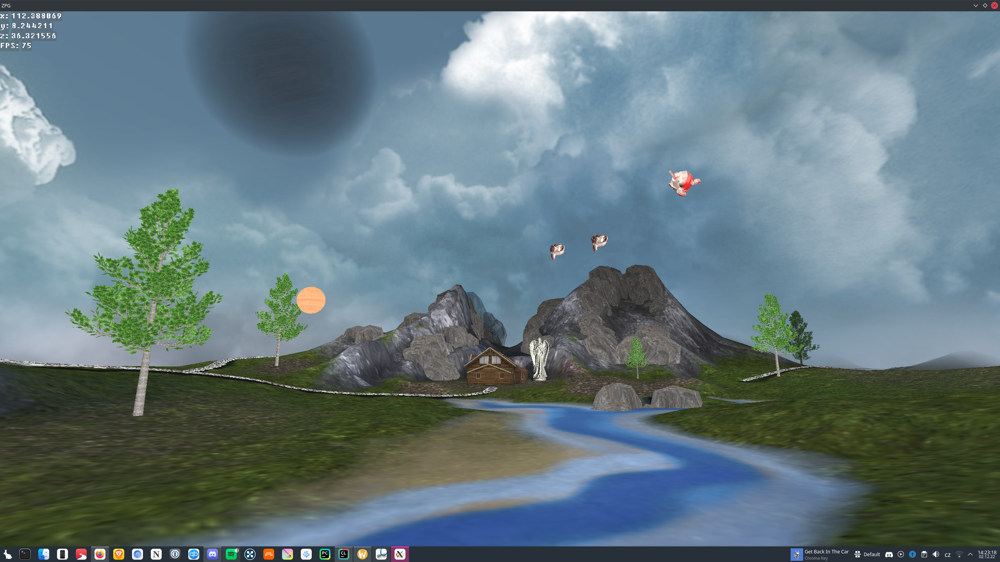
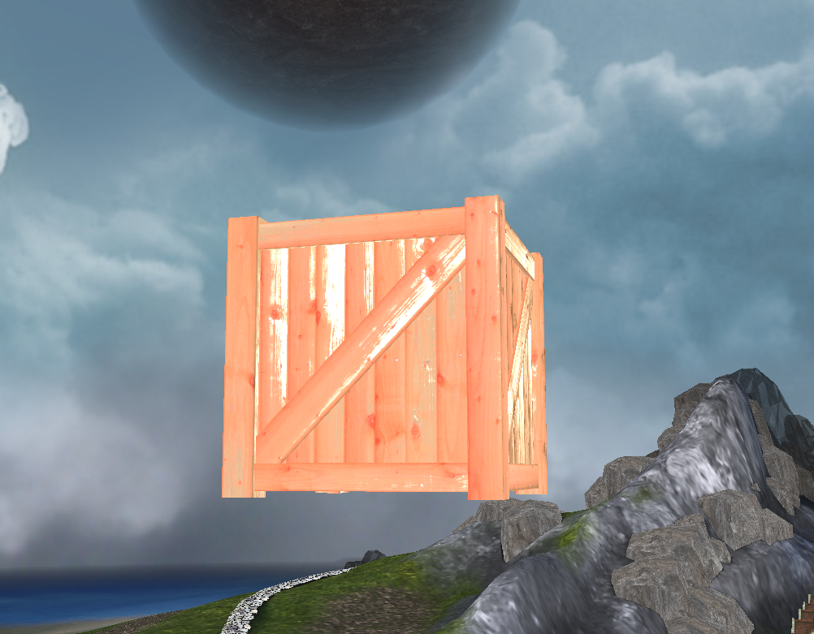
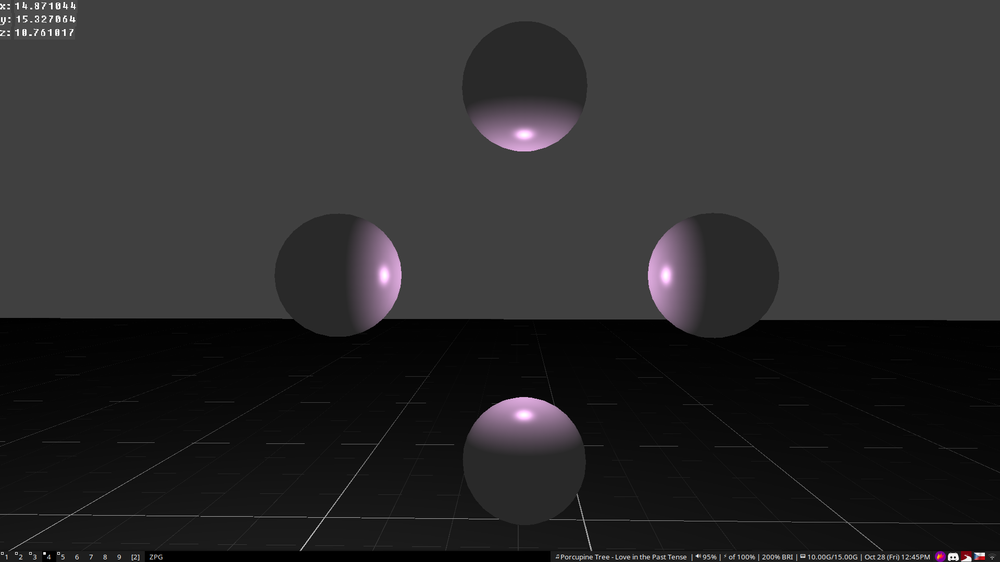

Project for an OpenGL course. 

### Installation
To install the project, you need to have the following dependencies installed:
* GLFW 3
* GLEW
* ASSIMP
* GLM

Arch linux:  
`sudo pacman -S glfw glew assimp glm`

Then run in the root of the project:
`cmake .`
`make`

### Legal
This project is licensed under the MIT license. In source contained glText (Zlib license, modified source) and stb_image (public domain).

