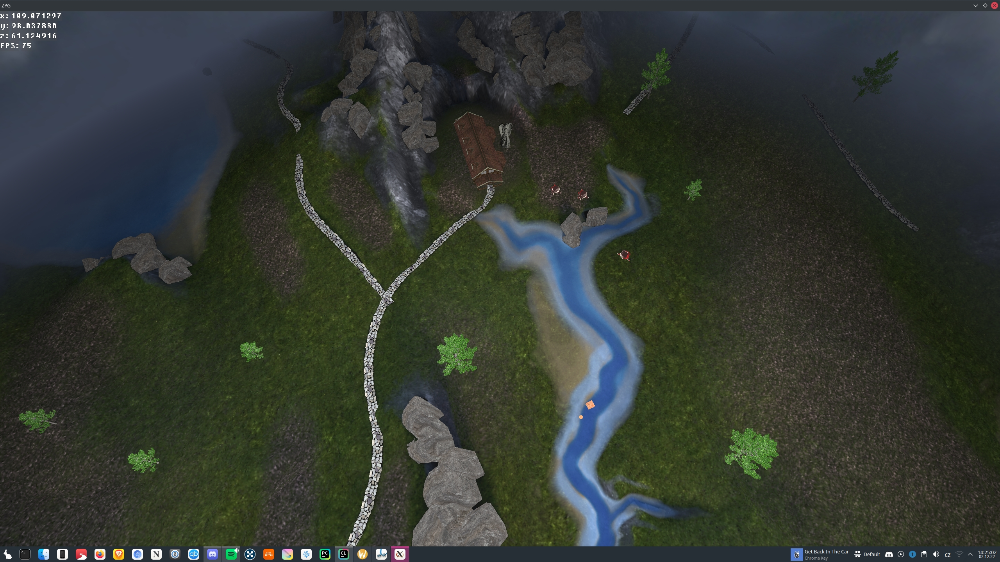

Project for an OpenGL course. 

### Installation
To install the project, you need to have the following dependencies installed:
* GLFW 3
* GLEW
* ASSIMP
* GLM

Arch linux:  
`sudo pacman -S glfw glew assimp glm`

Then run in the root of the project:  
`cmake . -Bbuild`  
`cd build`  
`make`  
`./ZPG`

### Legal
* This project is licensed under the MIT license. In source contained glText (Zlib license, modified source) and stb_image (public domain).  
* Terrain model and textures by fangzhangmnm on [sketchfab](https://sketchfab.com/3d-models/tabletop-terrain-895fa26a095c4e3896305e13e0abb5a1)  
* "Miramap" skybox by [Hipshot](https://www.zfight.com/misc/images/textures/envmaps/miramar_large.jpg)  
* Special thanks to learnopengl.com for the comprehensive tutorials.

